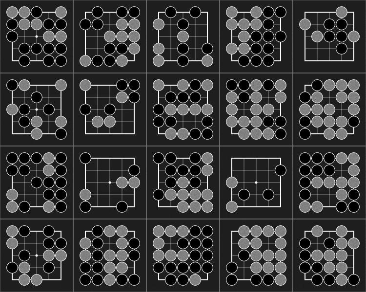

[](https://github.com/sotetsuk/pgx/actions/workflows/ci.yml)

# Pgx

A collection of GPU/TPU-accelerated game simulators for reinforcement learning.

<div align="center">

</div>

## APIs
Pgx's basic API consists of *pure functions* following the JAX's design principle.
This is to explicitly let users know that state transition is determined ONLY from `state` and `action` and to make it easy to use `jax.jit`.
Pgx defines the games as AEC games (see PettingZoo paper), in which only one agent acts and then turn changes.


### Design goal
1. Be explicit
2. Be simple than be universal


### Basic Usage

```py
import jax
import pgx

batch_size = 4096

env = pgx.make("Go-19x19/v0")
init = jax.jit(jax.vmap(env.init))  # jittable
step = jax.jit(jax.vmap(env.step))  # jittable

keys = jax.random.split(jax.random.PRNGKey(42), batch_size)
state = init(keys)
while not state.terminated.all():
    action = model(state.current_player, state.observation, state.legal_action_mask)
    state = step(state, action)
```

### Limitations (for the simplicity)
* Does **NOT** support agent death and creation, which dynmically changes the array size. It does not well suit to GPU-accelerated computation.
* Does **NOT** support Chance player (Nature player) with action selection.
* Does **NOT** support OpenAI Gym API.
    * OpenAI Gym is for single-agent environment. Most of Pgx environments are multi-player games. Just defining opponents is not enough for converting multi-agent environemnts to OpenAI Gym environment. E.g., in the game of go, the next state s' is defined as the state just after placing a stone in AlhaGo paper. However, s' becomes the state after the opponents' play. This changes the definition of V(s').
* Does **NOT** support PettingZoo API.
    * PettingZoo is *Gym for multi-agent RL*. As far as we know, PettingZoo does not support vectorized environments (like VectorEnv in OpenAI Gym). As Pgx's main feature is highly vectorized environment via GPU/TPU support, We do not currently support PettingZoo API. 

### `skip_chance`
* We prepare skip_chance=True option for some environments. This makes it possible to consider value function for "post-decision states" (See AlgoRL book). However, we do not allow chance agent to choose action like OpenSpiel. This is because the action space of chance agent and usual agent are different. Thus, when the chance player is chosen (`current_player=-1`), `action=-1` must be returned to step function. Use `shuffle` to make `step` stochastic.

### truncatation and auto_reset
* supported by `make(env_id="...", auto_reset=True, max_episode_length=64)`
* `auto_reset` will replace the terminal state by initial state (but `is_terminal=True` is set)
* `is_truncated=True` is also set to state

### Concerns
* For efficient computation, current_player must be synchronized? but it seems difficult (or impossible?). It is impossible to synchronize the terminations.

## Roadmap

<table>
<tr>
  <th>Game</th>
  <th>Environment</th>
  <th>Visualization</th>
  <th>Baseline algo/model</th>
  <th>Document</th>
</tr>
<tr>
 <td>TicTacToe</td>
 <td>:white_check_mark:</td>
 <td>:white_check_mark:</td>
 <td></td>
 <td></td>
</tr>
<tr>
 <td> <a href="https://en.wikipedia.org/wiki/D%C5%8Dbutsu_sh%C5%8Dgi">Animal Shogi</a> </td>
 <td>:white_check_mark:</td>
 <td>:white_check_mark:</td>
 <td></td>
 <td></td>
</tr>
<tr>
 <td><a href="https://sugorokuya.jp/p/suzume-jong">Sparrow Mahjong</a></td>
 <td>:white_check_mark:</td>
 <td>:white_check_mark:</td>
 <td></td>
 <td></td>
</tr>
<tr>
 <td><a href="https://github.com/kenjyoung/MinAtar">MinAtar</a>/Asterix</td>
 <td>:white_check_mark:</td>
 <td></td>
 <td></td>
 <td></td>
</tr>
<tr>
 <td><a href="https://github.com/kenjyoung/MinAtar">MinAtar</a>/Breakout</td>
 <td>:white_check_mark:</td>
 <td></td>
 <td></td>
 <td></td>
</tr>
<tr>
 <td><a href="https://github.com/kenjyoung/MinAtar">MinAtar</a>/Freeway</td>
 <td>:white_check_mark:</td>
 <td></td>
 <td></td>
 <td></td>
</tr>
<tr>
 <td><a href="https://github.com/kenjyoung/MinAtar">MinAtar</a>/Seaquest</td>
 <td>:white_check_mark:</td>
 <td></td>
 <td></td>
 <td></td>
</tr>
<tr>
 <td><a href="https://github.com/kenjyoung/MinAtar">MinAtar</a>/SpaceInvaders</td>
 <td>:white_check_mark:</td>
 <td></td>
 <td></td>
 <td></td>
</tr>
<tr>
 <td>Chess</td>
 <td>:construction:</td>
 <td>:white_check_mark:</td>
 <td></td>
 <td></td>
</tr>
<tr>
 <td>Shogi</td>
 <td>:white_check_mark:</td>
 <td>:white_check_mark:</td>
 <td>:construction:</td>
 <td></td>
</tr>
<tr>
 <td>Go</td>
 <td>:white_check_mark:</td>
 <td>:white_check_mark:</td>
 <td></td>
 <td></td>
</tr>
<tr>
 <td>Backgammon</td>
 <td>:white_check_mark:</td>
 <td>:white_check_mark:</td>
 <td></td>
 <td></td>
</tr>
<tr>
 <td>Bridge Bidding</td>
 <td>:construction:</td>
 <td>:white_check_mark:</td>
 <td></td>
 <td></td>
</tr>
<tr>
 <td>Mahjong</td>
 <td>:construction:</td>
 <td></td>
 <td></td>
 <td></td>
</tr>


</table>

## LICENSE

TDOO

* MinAtar is GPL-3.0 License
