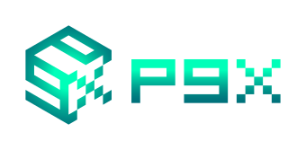
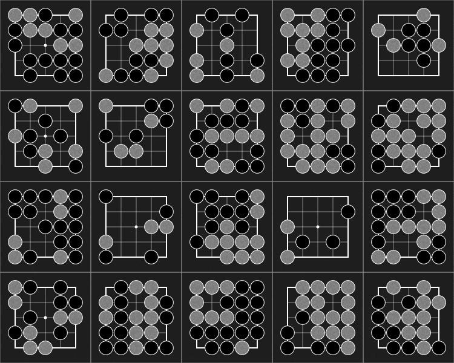

[](https://github.com/sotetsuk/pgx/actions/workflows/ci.yml)

<div align="center">

</div>

A collection of GPU/TPU-accelerated parallel game simulators for reinforcement learning (RL)

<div align="center">

</div>

## Why Pgx?

<!--- 
throughput: https://colab.research.google.com/drive/1gIWHYLKBxE2XKDhAlEYKVecz3WG4czdz#scrollTo=V1QZhRXoGL8K
--->

[Brax](https://github.com/google/brax), a [JAX](https://github.com/google/jax)-native physics engine, provides extremely high-speed parallel simulation for RL in *continuous* state space.
Then, what about RL in *discrete* state spaces like Chess, Shogi, and Go? **Pgx** provides a wide variety of JAX-native game simulators! Highlighted features include:

- **JAX-native.** All `step` functions are *jittable*
- **Super fast** in parallel execution (much faster than C++/Python implementation)
- **Various game support** including **Backgammon**, **Shogi**, and **Go**
- **Beautiful visualization** in SVG format


## Install

```sh
pip install pgx
```

## Usage

```py
import jax
import pgx

env = pgx.make("go-19x19")
init = jax.jit(jax.vmap(env.init))  # vectorize and JIT-compile
step = jax.jit(jax.vmap(env.step))

batch_size = 1024
keys = jax.random.split(jax.random.PRNGKey(42), batch_size)
state = init(keys)  # vectorized states
while not state.terminated.all():
    action = model(state.current_player, state.observation, state.legal_action_mask)
    state = step(state, action)  # state.reward (2,)
```

<!---
### Limitations (for the simplicity)
* Does **NOT** support agent death and creation, which dynmically changes the array size. It does not well suit to GPU-accelerated computation.
* Does **NOT** support Chance player (Nature player) with action selection.
* Does **NOT** support OpenAI Gym API.
    * OpenAI Gym is for single-agent environment. Most of Pgx environments are multi-player games. Just defining opponents is not enough for converting multi-agent environemnts to OpenAI Gym environment. E.g., in the game of go, the next state s' is defined as the state just after placing a stone in AlhaGo paper. However, s' becomes the state after the opponents' play. This changes the definition of V(s').
* Does **NOT** support PettingZoo API.
    * PettingZoo is *Gym for multi-agent RL*. As far as we know, PettingZoo does not support vectorized environments (like VectorEnv in OpenAI Gym). As Pgx's main feature is highly vectorized environment via GPU/TPU support, We do not currently support PettingZoo API. 

### `skip_chance`
* We prepare skip_chance=True option for some environments. This makes it possible to consider value function for "post-decision states" (See AlgoRL book). However, we do not allow chance agent to choose action like OpenSpiel. This is because the action space of chance agent and usual agent are different. Thus, when the chance player is chosen (`current_player=-1`), `action=-1` must be returned to step function. Use `shuffle` to make `step` stochastic.

### truncatation and auto_reset
* supported by `make(env_id="...", auto_reset=True, max_episode_length=64)`
* `auto_reset` will replace the terminal state by initial state (but `is_terminal=True` is set)
* `is_truncated=True` is also set to state
--->

## Game support road map

Use `pgx.available_games()` to see the list of currently available games.

<div align="center">
<table>
<tr>
  <th>Game</th>
  <th>Environment</th>
  <th>Visualization</th>
</tr>
<tr>
 <td> <a href="https://en.wikipedia.org/wiki/D%C5%8Dbutsu_sh%C5%8Dgi">Animal Shogi</a> </td>
 <td>:construction:</td>
 <td>:white_check_mark:</td>
</tr>
<tr>
 <td><a href="https://en.wikipedia.org/wiki/Backgammon">Backgammon</a></td>
 <td>:white_check_mark:</td>
 <td>:white_check_mark:</td>
</tr>
<tr>
 <td><a href="https://en.wikipedia.org/wiki/Contract_bridge">Bridge Bidding</a></td>
 <td>:construction:</td>
 <td>:white_check_mark:</td>
</tr>
<tr>
 <td><a href="https://en.wikipedia.org/wiki/Chess">Chess</a></td>
 <td>:construction:</td>
 <td>:white_check_mark:</td>
</tr>
<tr>
 <td><a href="https://en.wikipedia.org/wiki/Connect_Four">Connect Four</a></td>
 <td>:white_check_mark:</td>
 <td>:white_check_mark:</td>
</tr>
<tr>
 <td><a href="https://en.wikipedia.org/wiki/Go_(game)">Go</a></td>
 <td>:white_check_mark:</td>
 <td>:white_check_mark:</td>
</tr>
<tr>
 <td><a href="https://en.wikipedia.org/wiki/Hex_(board_game)">Hex</a></td>
 <td>:white_check_mark:</td>
 <td>:white_check_mark:</td>
</tr>
<tr>
 <td><a href="https://en.wikipedia.org/wiki/Japanese_mahjong">Mahjong</a></td>
 <td>:construction:</td>
 <td></td>
</tr>
<tr>
 <td><a href="https://github.com/kenjyoung/MinAtar">MinAtar/Asterix</a></td>
 <td>:white_check_mark:</td>
 <td>:white_check_mark:</td>
</tr>
<tr>
 <td><a href="https://github.com/kenjyoung/MinAtar">MinAtar/Breakout</a></td>
 <td>:white_check_mark:</td>
 <td>:white_check_mark:</td>
</tr>
<tr>
 <td><a href="https://github.com/kenjyoung/MinAtar">MinAtar/Freeway</a></td>
 <td>:white_check_mark:</td>
 <td>:white_check_mark:</td>
</tr>
<tr>
 <td><a href="https://github.com/kenjyoung/MinAtar">MinAtar/Seaquest</a></td>
 <td>:white_check_mark:</td>
 <td>:white_check_mark:</td>
</tr>
<tr>
 <td><a href="https://github.com/kenjyoung/MinAtar">MinAtar/SpaceInvaders</a></td>
 <td>:white_check_mark:</td>
 <td>:white_check_mark:</td>
</tr>
<tr>
 <td><a href="https://en.wikipedia.org/wiki/Reversi">Othello</a></td>
 <td>:white_check_mark:</td>
 <td>:white_check_mark:</td>
</tr>
<tr>
 <td><a href="https://en.wikipedia.org/wiki/Shogi">Shogi</a></td>
 <td>:white_check_mark:</td>
 <td>:white_check_mark:</td>
</tr>
<tr>
 <td><a href="https://sugorokuya.jp/p/suzume-jong">Sparrow Mahjong</a></td>
 <td>:white_check_mark:</td>
 <td>:white_check_mark:</td>
</tr>
<tr>
 <td><a href="https://en.wikipedia.org/wiki/Tic-tac-toe">Tic-tac-toe</a></td>
 <td>:white_check_mark:</td>
 <td>:white_check_mark:</td>
</tr>
<tr>
 <td><a href="https://en.wikipedia.org/wiki/2048_(video_game)">2048</a></td>
 <td>:white_check_mark:</td>
 <td>:white_check_mark:</td>
</tr>
</table>
</div>

## See also

Pgx is intended to complement these **JAX-native environments** with (classic) board game suits:

- [RobertTLange/gymnax](https://github.com/RobertTLange/gymnax): Classic control, bsuite, etc.
- [google/brax](https://github.com/google/brax): Rigidbody physics simulation
- [instadeepai/jumanji](https://github.com/instadeepai/jumanji): Industry-driven environments (e.g., Travelling Salesman Problem)

Combining Pgx with these **JAX-native algorithms/implementations** might be an interesting direction:

- [Anakin framework](https://arxiv.org/abs/2104.06272): Highly efficient RL framework that works with JAX-native environments on TPUs
- [deepmind/mctx](https://github.com/deepmind/mctx): JAX-native MCTS implementations, including AlphaZero and MuZero
- [deepmind/rlax](https://github.com/deepmind/rlax): JAX-native RL components
- [google/evojax](https://github.com/google/evojax): Hardware-Accelerated neuroevolution
- [RobertTLange/evosax](https://github.com/RobertTLange/evosax): JAX-native evolution strategy (ES) implementations
- [adaptive-intelligent-robotics/QDax](https://github.com/adaptive-intelligent-robotics/QDax): JAX-native Quality-Diversity (QD) algorithms


## LICENSE

Apache-2.0
