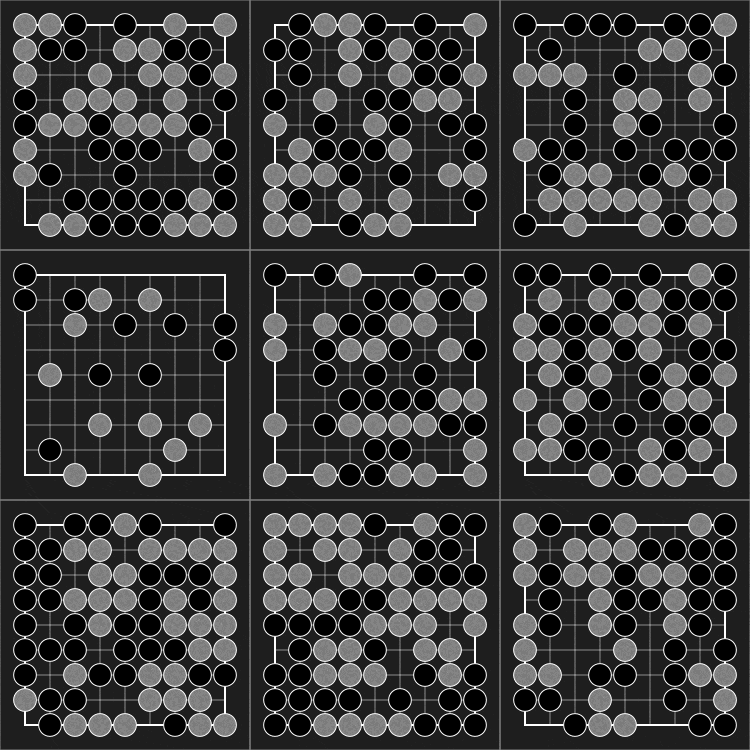

<p align="center">

</p>

<p align="center">

</p>

# Pgx Documentation
 

```py
import jax
import pgx

env = pgx.make("go_19x19")
init = jax.jit(jax.vmap(env.init))
step = jax.jit(jax.vmap(env.step))

batch_size = 1024
keys = jax.random.split(jax.random.PRNGKey(42), batch_size)
state = init(keys)  # vectorized states
while not (state.terminated | state.truncated).all():
    action = model(state.current_player, state.observation, state.legal_action_mask)
    state = step(state, action)  # state.reward (2,)
```

