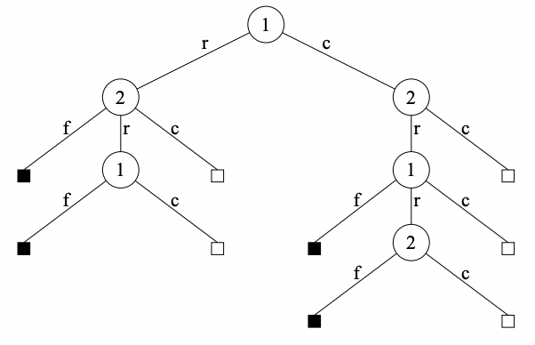

# Leduc hold’em

=== "dark" 

    

    
    

=== "light" 

    

    
    

## Description
Leduc hold’em is a simplified poker proposed in [Souhty+05].

## Rules
We quote the description in  [Souhty+05]:

> **Leduc Hold ’Em.** We have also constructed a smaller
version of hold ’em, which seeks to retain the strategic elements of the large game while keeping the size of the game
tractable. In Leduc hold ’em, the deck consists of two suits
with three cards in each suit. There are two rounds. In the
first round a single private card is dealt to each player. In
the second round a single board card is revealed. There is
a two-bet maximum, with raise amounts of 2 and 4 in the
first and second round, respectively. Both players start the
first round with 1 already in the pot.

> 
> 
> Figure 1: An example decision tree for a single betting
round in poker with a two-bet maximum. Leaf nodes with
open boxes continue to the next round, while closed boxes
end the hand.

## References

- [Souhty+05] [Bayes' Bluff: Opponent Modelling in Poker](https://arxiv.org/abs/1207.1411) UAI2005