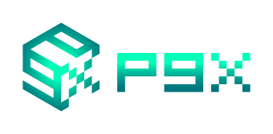

<p align="center">

</p>

# Welcome to Pgx Documentation

:muscle:

!!! check "Beautiful visualization"

    Beatuiful visualization


!!! success

    Lorem ipsum dolor sit amet, consectetur adipiscing elit. Nulla et euismod
    nulla. Curabitur feugiat, tortor non consequat finibus, justo purus auctor
    massa, nec semper lorem quam in massa.


## tab


=== "C"

    ``` c
    #include <stdio.h>

    int main(void) {
      printf("Hello world!\n");
      return 0;
    }
    ```

=== "C++"

    ``` c++
    #include <iostream>

    int main(void) {
      std::cout << "Hello world!" << std::endl;
      return 0;
    }
    ```


```py title="bubble_sort.py"
import jax
import pgx

env = pgx.make("go-19x19")
init = jax.jit(jax.vmap(env.init))  # vectorize and JIT-compile
step = jax.jit(jax.vmap(env.step))

batch_size = 1024
keys = jax.random.split(jax.random.PRNGKey(42), batch_size)
state = init(keys)  # vectorized states
while not state.terminated.all():
    action = model(state.current_player, state.observation, state.legal_action_mask)
    state = step(state, action)  # state.reward (2,)
```


{ align=left width=20% }


WIP.

# README

{!README.md!}
