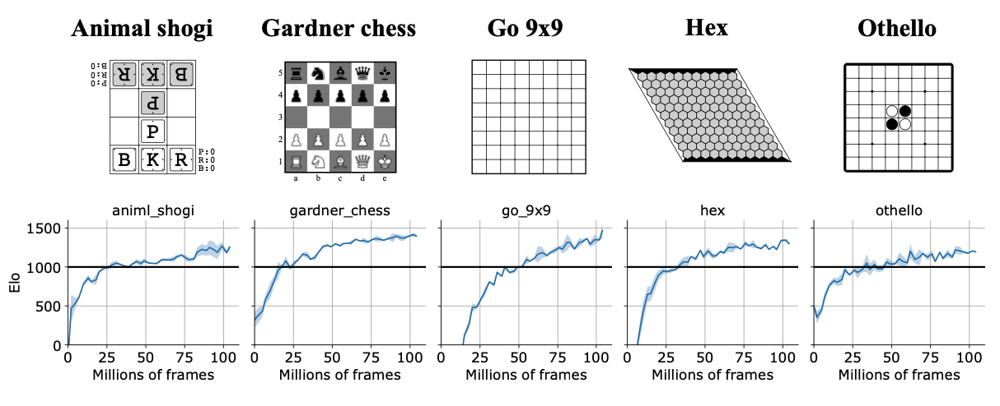

# AlphaZero example

A simple (Gumbel) AlphaZero [[Silver+18](https://www.science.org/doi/10.1126/science.aar6404), [Danihelka+22](https://openreview.net/forum?id=bERaNdoegnO)] example using [Mctx](https://github.com/deepmind/mctx) library. See [Pgx paper](https://openreview.net/forum?id=UvX8QfhfUx) for more details.



## Usage

Note that you need to install `jax` and `jaxlib` in addition to the packages written in `requirements.txt` according to your execution environment.

```sh
$ pip install -U pip && pip install -r requirements.txt
$ python3 train.py env_id=go_9x9 seed=0
```

## Reference

- [[Silver+18](https://www.science.org/doi/10.1126/science.aar6404)] "A general reinforcement learning algorithm that masters
chess, shogi, and go through self-play"
- [[Danihelka+22](https://openreview.net/forum?id=bERaNdoegnO)] "Policy improvement by planning with Gumbel"


## Change history

- **[#1088](https://github.com/sotetsuk/pgx/pull/1088)** Adjust to API v2 ([wandb report](https://api.wandb.ai/links/sotetsuk/0g44pjsg)).
- **[#1055](https://github.com/sotetsuk/pgx/pull/1055)** Use default Gumbel AlphaZero hyperparameters ([wandb report](https://api.wandb.ai/links/sotetsuk/o8752t54)).
- **[#1026](https://github.com/sotetsuk/pgx/pull/1026)** Initial version. Supposed to reproduce the [Pgx paper](https://openreview.net/forum?id=UvX8QfhfUx) results ([wandb report](https://api.wandb.ai/links/sotetsuk/5q30e5n9)).
