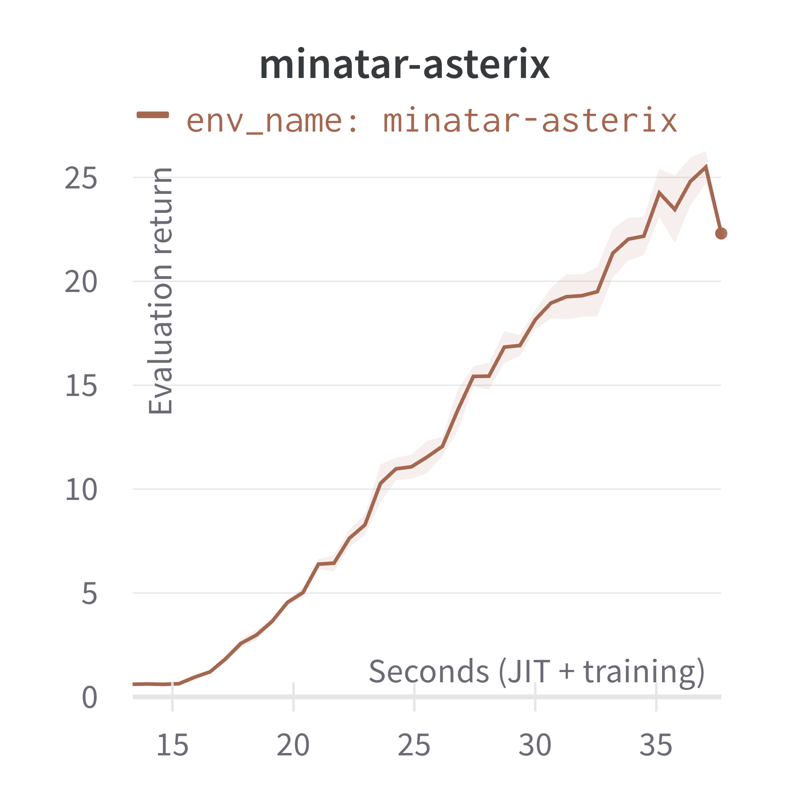
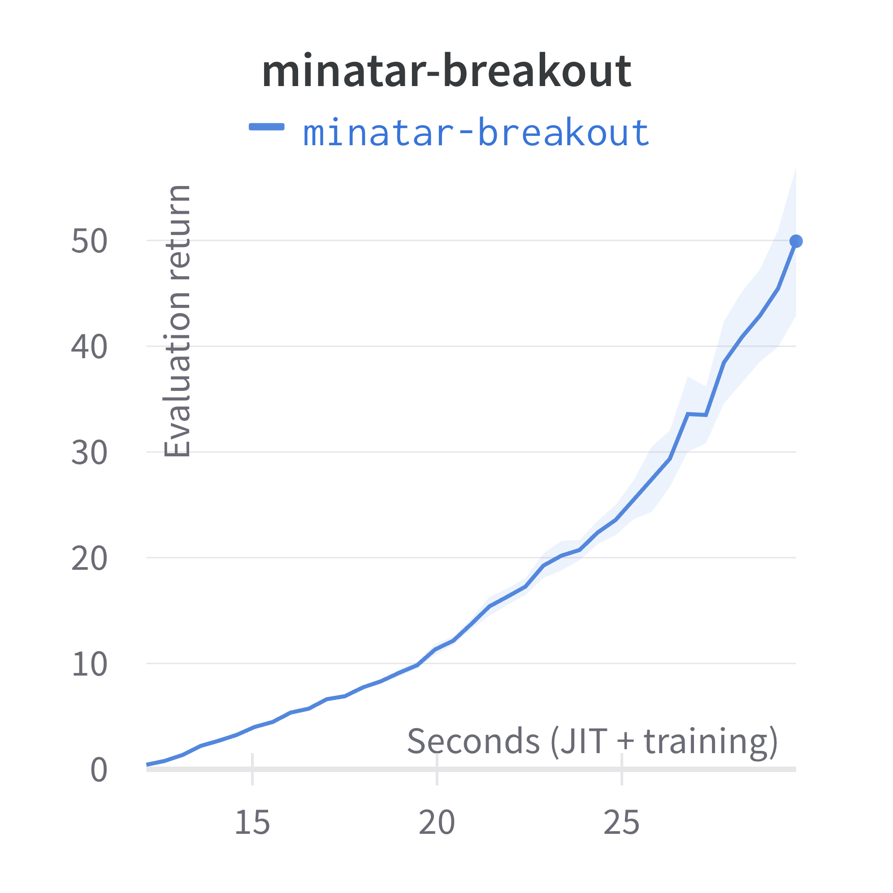
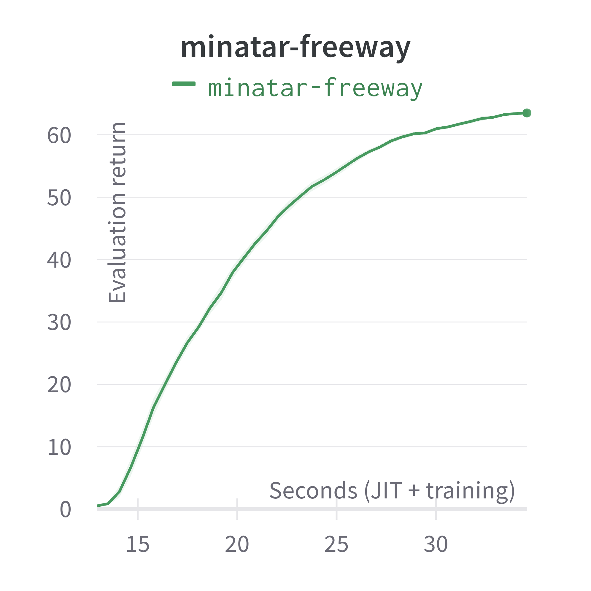
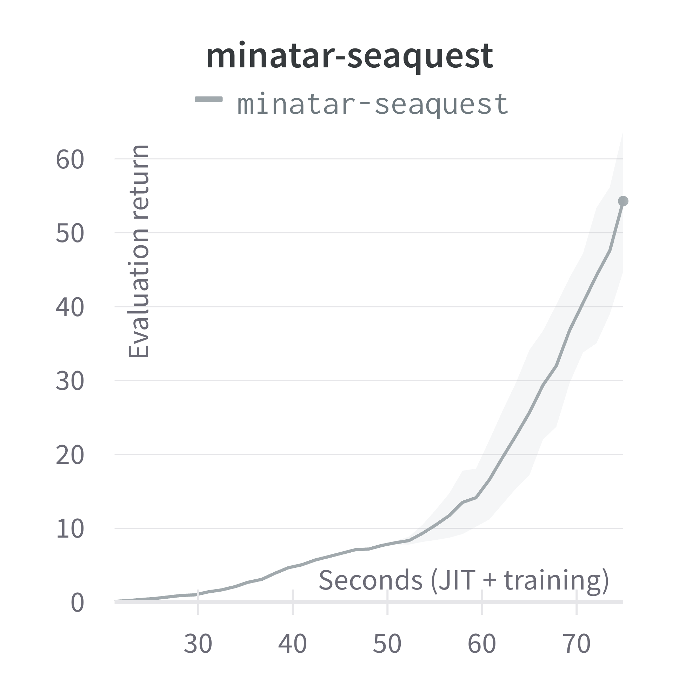
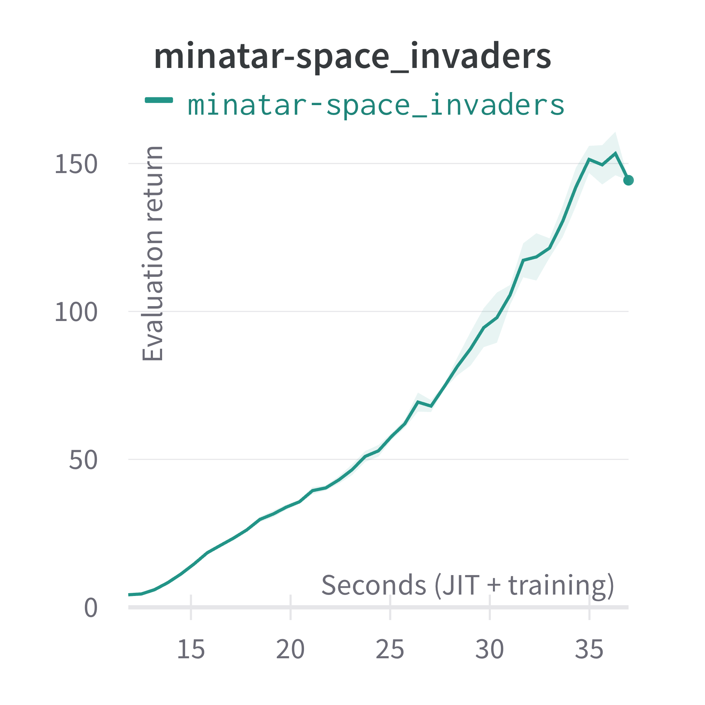

# MinAtar PPO Example

MinAtar is a simplified benchmark of Atari-like visual input environments, which is used for comprehensive ablation studies.
Pgx implements **all** five MinAtar environments, and this PPO example learns them in a very short time (e.g., 1 min).
For more details, please see the Appendix of [our paper](https://arxiv.org/abs/2303.17503).

## Results

|Asterix|Breakout|Freeway|Seaquest|Space Invaders|
|:---:|:---:|:---:|:---:|:---:|
||||||

See [wandb report](https://api.wandb.ai/links/sotetsuk/kvd3fzge) for more details.

## Usage

Note that you need to install `jax` and `jaxlib` in addition to the packages written in `requirements.txt` according to your execution environment.

```sh
$ pip install -r requirements.txt
$ python3 train.py env_name=minatar-breakout seed=9999
```

## Change history

- **[#1098](https://github.com/sotetsuk/pgx/pull/1098)** Adjust to API v2 ([wandb report](https://api.wandb.ai/links/sotetsuk/1j4a32aq)).
- **[#1020](https://github.com/sotetsuk/pgx/pull/1020)** Initial version ([wandb report](https://api.wandb.ai/links/sotetsuk/kvd3fzge)).
